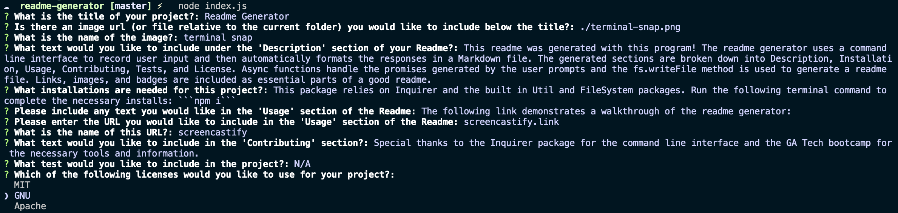

[](https://opensource.org/licenses/MIT)
  # Readme Generator

  

  ## Table of Contents
  * [Description](#description)
  * [Installation](#installation)
  * [Usage](#usage)
  * [Contributing](#contributing)
  * [Tests](#tests)
  * [Questions](#questions)
  * [License](#license)

  ## Description
  This readme was generated with this program! The readme generator uses a command line interface to record user input and then automatically formats the responses in a Markdown file. The generated sections are broken down into Description, Installation, Usage, Contributing, Tests, and License. Async functions handle the promises generated by the user prompts and the fs.writeFile method is used to generate a readme file. Links, images, and badges are included as essential parts of a good readme. 
  ## Installation
  This package runs in Node and relies on Inquirer and the built in Util and FileSystem packages. Run the following terminal command to complete the necessary installs from package.json: ```npm i```
  ## Usage
  The following link demonstrates a walkthrough of the readme generator:
  
  [screencastify](link.com)
  ## Contributing
  Special thanks to the Inquirer package for the command line interface and the GA Tech bootcamp for the necessary tools and information. 
  ## Tests
  N/A
  ## Questions
  Github profile: [dgtlctzn](https://github.com/dgtlctzn)
  
  If you have any questions about the project please contact josephperry720@gmail.com
  ## License
  This project is covered under the MIT license
